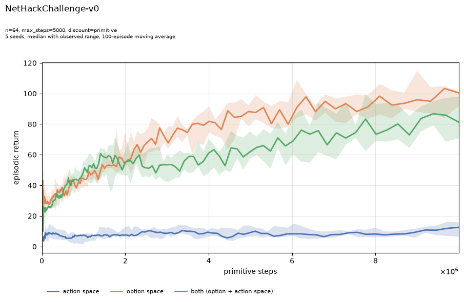

# Options by Construction: Transforming NetHack's Action Space into an Easier MDP Without Discovery

NetHack hands the agent a flat table of keystrokes. This repository replaces that table with a catalogue of options enumerated by a grammar over the same interface, so nothing is discovered, learned or trained to produce them, and measures what the substitution buys. Every option is a closed-loop `(I, π, β)` controller, so the agent faces a temporally extended MDP arrived at by construction rather than by search. The catalogue is compared against the primitive action set and against the union of the two, on a budget denominated in primitive steps so every arm buys the same environment interaction. On `NetHackChallenge-v0` at 10M primitive steps, 64 options reach a median return of roughly 100 against 13 for primitives.



Example `plot.py` output (`exp1`, `NetHackChallenge-v0`, grammar catalogue at n=64, primitive discounting, 10M primitive steps, 5 seeds). Five seeds is below the bootstrap cutoff, so the band is the observed range across seeds rather than a confidence interval.

## What is being compared

Three conditions, identical in every other respect:


| Condition | Action table                                                   |
| --------- | -------------------------------------------------------------- |
| `action`  | the environment's own primitives (NLE drops `QUIT` and `SAVE`) |
| `option`  | a catalogue of temporally extended options                     |
| `both`    | the primitives followed by the catalogue                       |


`both` is the control that carries the argument. It offers strictly more choices  
than the baseline, so a gain there cannot be explained by primitives having been  
taken away.

## The two tracks

The repository holds two independent implementations of the same design. They
share no code: PyTorch does not run under `jit`/`vmap`, so the trainers cannot be
factored together.


|             | `NLE/`                            | `navix/`                                                 |
| ----------- | --------------------------------- | -------------------------------------------------------- |
| Role        | primary, the dissertation         | testbed, iteration only                                  |
| Stack       | PyTorch, CleanRL PPO              | JAX, PureJaxRL-lineage PPO                               |
| Environment | NetHack Learning Environment      | Navix (JAX MiniGrid)                                     |
| Seeds       | one process per seed              | vmapped inside a cell                                    |
| Executor    | `OptionWrapper` (`gym.Wrapper`)   | `OptionEnv` (Navix `Environment`)                        |
| Catalogue   | 227 rows on `NetHackChallenge-v0` | `(heading, reach, interact, follow)` up to `max_forward` |
| Tests       | 161                               | 91                                                       |


Both PPO files are copied from upstream and edited in place, with a provenance
comment at the top of each.

## Getting started

### Prerequisites

- Linux with an NVIDIA GPU. Both runners abort rather than fall back to CPU.
- conda or mamba. NLE builds from source, and the environment file provides the
`cmake`, `bison` and `flex` it needs without root.

### Install

```bash
conda env create -f environment.yml
conda activate options-tcap
```

Check the driver's CUDA version with `nvidia-smi` before installing; the pip
index in `environment.yml` is pinned to `cu128`.

### First run

Print a sweep's matrix without touching a GPU:

```bash
cd NLE
python main.py --sweep exp1 --dry-run
```

Then train the smallest matrix there is — three conditions at 50k primitive
steps each:

```bash
python main.py --sweep smoke --seeds 1
```

## Running a sweep

A sweep is a matrix of cells; a cell is one point of it, trained at several
seeds. Each invocation stamps a fresh run group, so nothing resumes and nothing
is overwritten.

### NLE

`main.py` owns the group directory, the launch pool and the preflight.
`ppo.py` owns one seed of one cell.

```bash
cd NLE
python main.py --sweep exp2 --seeds 10 --gpus 0,1 --per-gpu 3
```


| Flag        | Default              | Purpose                              |
| ----------- | -------------------- | ------------------------------------ |
| `--sweep`   | `exp1`               | which matrix in `SWEEPS` to expand   |
| `--cell`    | all                  | run only the named cells, repeatable |
| `--seeds`   | `3`                  | seeds per cell, as `range(n)`        |
| `--gpus`    | every visible device | comma-separated device indices       |
| `--per-gpu` | `3`                  | concurrent trainers per device       |
| `--stagger` | `20.0`               | seconds between launches             |
| `--dry-run` | off                  | print the matrix and exit            |


`--seeds` overrides whatever the sweep declares, so it applies even to a sweep
written with a seed count of its own.

A single cell can also be trained directly, bypassing the pool:

```bash
python ppo.py --env-id NetHackChallenge-v0 --condition option \
  --n-options 64 --option-family grammar --discount primitive \
  --budget 10000000 --seed 0
```

### navix

One process runs the whole sweep, seeds vmapped inside each cell.

```bash
cd navix
python main.py --sweep exp1
python main.py --sweep exp4 --no-vmap   # seeds run in sequence, so a failure names one
```

## Drawing figures

`plot.py` reads the run store, slices it per run group, and picks the figures
that group's tag asks for. Curves aggregate with IQM and a bootstrap interval
over seeds; below 8 seeds the point estimate becomes the median and the band
becomes the observed range, which the figure states in its subtitle.

```bash
cd NLE
python plot.py --cells '*__exp1'
python plot.py --cells '0831-002132*' --only delay_sweep delay_advantage --format pdf
```

Figures land in `plots/<group>/`, each alongside the CSV it was drawn from in
`plots/<group>/csv/`. The registry holds 15 figures in `NLE/plot.py` and 14 in
`navix/plot.py`: learning curves, return ECDFs, option-count sweeps, threshold
tables, and the reward-delay family.

## Probing a catalogue

Before spending compute, `probe.py` reports what a catalogue actually contains
and what durations it realises under a uniform policy over the initiation sets.
It writes nothing.

```bash
cd NLE && python probe.py --condition option --n-options 64 --steps 10000
cd navix && python probe.py --action-space option --n-options 64 --max-forward 4
```

`NLE/sps_probe.py` measures the combined environment-plus-network step rate
against `num_envs`, forking a fresh process per configuration.

## Tests

pytest only, fully annotated, hand-constructed states over random rollouts where
the property is deterministic. Run from inside a track, so its flat imports
resolve:

```bash
cd NLE   && python -m pytest test_files/
cd navix && python -m pytest test_files/
```

## Output layout

Runs live under `<track>/runs/<mmdd-HHMMSS>__<env_id>__<tag>/<cell>/`. The cell
name is derived from its configuration, so a label cannot disagree with what was
run.


| File                                 | Written by | Contents                                        |
| ------------------------------------ | ---------- | ----------------------------------------------- |
| `episodes_seed{N}.csv` (NLE)         | trainer    | one row per finished episode, 63 columns        |
| `episodes.csv` (navix)               | runner     | the same, appended per chunk across seeds       |
| `decisions_seed{N}_part{KK}.parquet` | trainer    | one row per decision, ~13 B/row                 |
| `provenance_seed{N}.json`            | trainer    | per-seed record, written unconditionally        |
| `meta.json`                          | runner     | config plus measured duration stats             |
| `failures.json`                      | runner     | every failed run and the command that reruns it |


`meta.json` is the cell-level aggregate and appears only when every seed  
succeeded; `provenance_seed{N}.json` is what a partially failed cell leaves  
behind.

## The experiment matrix


| Sweep  | Question                                               | Axis           |
| ------ | ------------------------------------------------------ | -------------- |
| `exp1` | Does the option arm separate from the baseline at all? | condition      |
| `exp2` | How does the advantage depend on catalogue size?       | `n_options`    |
| `exp3` | Is it the catalogue's construction or its existence?   | family, draw   |
| `exp4` | Does the advantage widen with reward delay?            | `reward_delay` |


